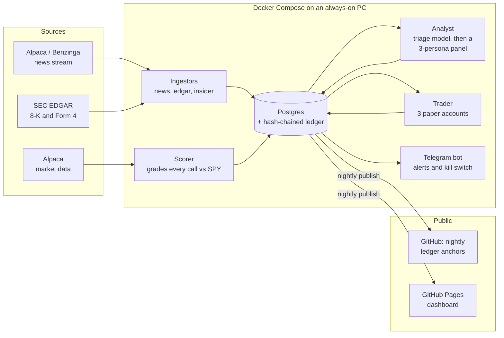

# driftwatch

**An AI news-trading experiment that keeps its own receipts.**

**Live dashboard: [grant833.github.io/driftwatch](https://grant833.github.io/driftwatch/)**

Most trading bots are sold on screenshots of good months. driftwatch is built the other way
around: every prediction is written to a hash-chained ledger and anchored in this repo's git
history *before* the outcome is known, then graded against simply buying the S&P 500. Three
paper-money strategies compete under identical risk rules, including one that uses no AI at all,
and the statistics are deflated for the number of strategies tried. If the AI can't beat a
one-line rule, it doesn't get real money.

### What makes it different

- **Provable, not claimed.** Append-only ledger (Postgres triggers forbid edits), SHA-256 hash
  chain, nightly anchor commits in [`anchors/`](anchors/). Anyone can check that a call predates
  its result.
- **Slow on purpose.** It can't win a speed race against funds, so it looks for news the market
  hasn't fully absorbed and holds for days, not milliseconds.
- **Skeptical statistics.** Point-in-time entry prices, results clustered by day, beta-adjusted
  returns, Probabilistic and Deflated Sharpe Ratios, and a pre-registered historical backtest.
- **A control group.** A no-AI SPY trend strategy runs alongside the AI accounts.

### Architecture



## Status: Phase 2 (paper-trading tournament)

| Component | What it does |
|---|---|
| `news` service | Alpaca/Benzinga news over WebSocket, with automatic REST gap-fill on every reconnect |
| `edgar` service | Polls SEC EDGAR for new 8-K (material events) and Form 4 (insider trades) filings, maps CIK to ticker |
| `insider` service | Parses every Form 4, flags discretionary open-market buys by officers/directors (code P, no 10b5-1 plan, ≥ $25k) |
| `analyst` service | Stage 1: cheap model triages every headline in batches and scores market-wide mood. Stage 2: three analyst personas (fundamental, skeptic, flow) independently estimate P(stock beats SPY over 5 days); agreement becomes confidence; every verdict is written to the ledger |
| `scorer` service | Pulls split/dividend-adjusted daily bars and grades every prediction at 1, 5 and 10 sessions as excess return vs SPY, and beta-adjusted (beta estimated only from bars before entry), using conservative point-in-time entry rules (premarket → that day's open, intraday → that day's close, after hours → next open) |
| `notifier` service | Telegram bot: insider buys, strong AGREE calls, problems, and a weekday after-close summary; commands `/status /today /insiders /score /mood /costs /kill /resume`. Obeys only the owner's chat |
| Universe & budget | Only US exchange-listed stocks Alpaca can trade, priced at $5+, ETFs excluded. Triage rates importance 1–5; the panel scores the most important news first, and its daily call budget is released evenly through the US/Eastern day so a busy morning can't starve after-close earnings |
| "Priced in?" check | At prediction time the panel sees how far the stock has already moved vs the prior close (IEX snapshot), and the move is stored with the prediction |
| `trader` service | Paper trading with three Alpaca paper accounts competing: **news** (the AI panel: AGREE, p_up ≥ 0.55, not already priced in, 5-day holds), **insider** (officer/director open-market buys, 20-day holds) and **baseline** (SPY while above its 200-day average, otherwise cash: no AI at all). Marketable limit orders only, volatility-scaled sizes, max 10% per stock, no margin, stop-losses, time exits, exit when the panel turns bearish, half the slots when SPY is in a downtrend, a 3% daily-loss brake and a 15% drawdown halt. Every order is written to the hash-chained ledger first |
| Safety | Refuses any non-paper Alpaca URL unless `trading.allow_live: true`. Telegram `/kill` halts and cancels working orders; `/flatten confirm` sells everything and halts; `/resume confirm` restarts |
| `/perf` | Each account vs buy-and-hold SPY: return, max drawdown, Sharpe, probabilistic Sharpe, and the Deflated Sharpe Ratio adjusted for the number of strategies tried |
| `gdelt` service | Optional, off by default (GDELT's free API returned empty data in Oct 2026); replaced by headline-based market mood |
| Ledger | Hash-chained, append-only (enforced by Postgres triggers). Nightly, the chain is verified and its head is committed to this repo (`anchors/`), an outside timestamp proving each prediction predates its outcome |
| `backup` service | Nightly compressed `pg_dump` into `./backups`, integrity-checked, 14 days kept; Telegram alert on failure |
| Public dashboard | `docs/` (GitHub Pages): tournament vs SPY, prediction scorecard, recent calls with ledger numbers, trades, ledger proof, running costs. Data rebuilt nightly by `publish`; headlines are linked, never republished |
| Guards | Ticker blocklist so the bot never buys ETFs already held in a separate managed account (wash-sale protection) |
| Backtest | `backtest-load` + `backtest-insider`: the insider strategy replayed on every SEC Form 4 purchase since 2016 (SEC insider data sets, Alpaca bars), entering only after filings were public, with the live rules; config registered in the ledger before results are computed. Report in [`backtests/`](backtests/) |

Paper money only. Hard daily caps on API calls are enforced in code, and every call is logged for cost tracking.

## Design principles

- **Point-in-time honesty.** Every row stores `received_at` (when we learned it) separately from the
  source's timestamp. Backtests can only use what was actually known at the time.
- **Idempotent ingestion.** Every insert is `ON CONFLICT DO NOTHING`; services can restart freely.
- **No silent gaps.** The news stream backfills from its last stored article whenever it reconnects.
- **Append-only evidence.** Ledger rows cannot be updated, deleted, or truncated, and any edit to
  history breaks the hash chain.

## Quickstart

```bash
cp .env.example .env          # add Alpaca PAPER keys, SEC user agent with your email
docker compose up -d --build  # starts Postgres, runs migrations, starts all three ingestors
docker compose logs -f news   # watch headlines arrive

docker compose run --rm news health              # row counts for the last 24h
docker compose run --rm news ledger-note "hello" # append a ledger entry
docker compose run --rm news ledger-verify       # check the hash chain
docker compose run --rm publisher               # verify ledger, write anchor + dashboard data
docker compose run --rm news check-ticker VOO    # test the blocklist
docker compose run --rm news predictions         # latest panel verdicts
docker compose run --rm news insiders            # latest insider buy signals
docker compose run --rm news mood                # hourly market mood from headlines
docker compose run --rm news costs               # API calls and tokens per day
docker compose run --rm news score               # scorecard: hit rate, edge, IC vs SPY
docker compose run --rm news kill                # halt trading (same as /kill in Telegram)
docker compose run --rm news positions           # open paper positions
docker compose run --rm news perf                # tournament results vs SPY

# Historical backtest of the insider strategy (one-time download, ~15-30 min)
docker compose --profile tools build publisher       # on-demand service: rebuild after updates
docker compose run --rm publisher backtest-load      # SEC insider data, industry codes, bars
docker compose run --rm publisher backtest-insider   # report: backtests/ + dashboard
docker compose run --rm publisher backtest-diagnose  # where the return goes, vs SPY and IWM
docker compose run --rm news experiments             # pre-registered questions on live calls
```

Research behind the design and the pre-registered questions: [`backtests/RESEARCH.md`](backtests/RESEARCH.md).

Runs on any always-on machine with Docker and ~2 GB free RAM (Windows PC with Docker Desktop, a small Linux VM, or a Raspberry Pi 4/5 with 4 GB+).

## Setup checklist

1. Create an Alpaca account and generate **paper** API keys.
2. Replace `config/blocklist.txt` with every ETF you hold elsewhere (wash-sale guard).
3. Set `SEC_USER_AGENT` to your name and real email (SEC requirement).
4. Optional: add a Slack incoming webhook for alerts.
5. Windows: `powershell -ExecutionPolicy Bypass -File ops\install-nightly.ps1` registers the nightly
   publish (5:30 PM: verify, anchor, dashboard data, commit `anchors/` + `docs/`, push).
   Linux: cron `ops/nightly.ps1`'s equivalent (`docker compose run --rm publisher && git add anchors docs && git commit && git push`).
6. GitHub repo → Settings → Pages → Deploy from branch `main`, folder `/docs`.

## Backups

The `backup` service writes `backups/driftwatch-YYYY-MM-DD.dump` every night at 2:30 AM ET.
Restore into a fresh database:

```bash
docker compose stop news edgar insider analyst scorer notifier trader
docker compose exec -T db dropdb -U driftwatch driftwatch
docker compose exec -T db createdb -U driftwatch driftwatch
docker compose exec -T db pg_restore -U driftwatch -d driftwatch < backups/driftwatch-YYYY-MM-DD.dump
docker compose up -d
docker compose run --rm news ledger-verify
```

## Roadmap

- **Phase 1 (done):** Form 4 parsing, LLM triage plus analyst panel, predictions in the ledger.
- **Phase 1C (done):** "already priced in?" check, scorekeeper, Telegram bot with kill switch.
- **Phase 2 (running since Oct 8, 2026):** Three-way paper tournament (AI news, insider buys, SPY trend baseline), public dashboard, nightly anchors, historical backtest of the insider rules.
- **Phase 3 (mid-January 2027):** Go/no-go gate on Deflated Sharpe vs SPY after ~60 trading days; only a strategy that clears it gets a small real-money allocation.

## Tests

```bash
pip install -e ".[dev]"
pytest -q                                   # unit tests
TEST_DATABASE_URL=postgresql://... pytest   # adds Postgres integration tests (CI runs these)
```
